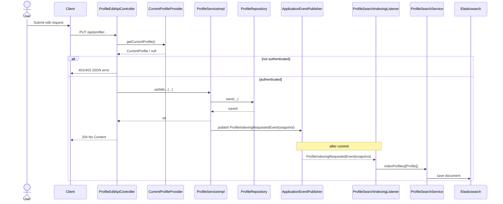
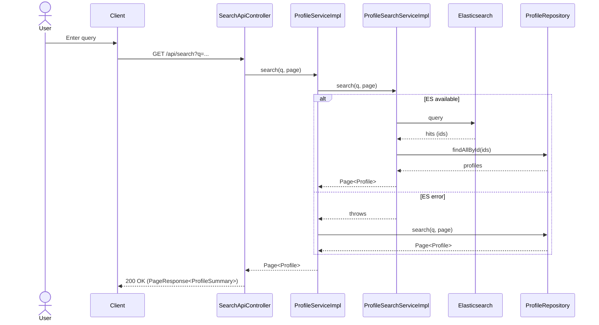
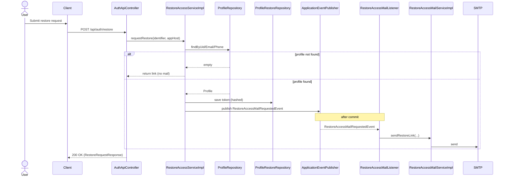
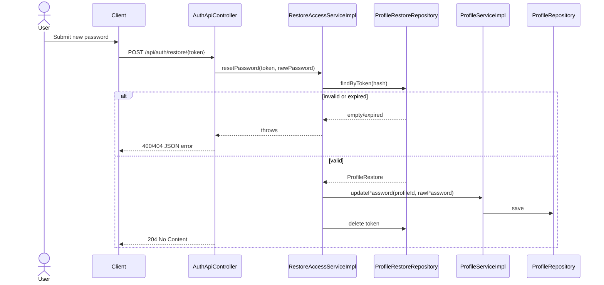
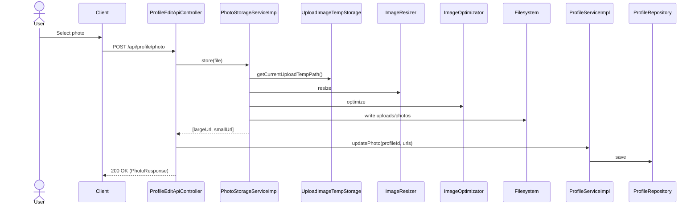
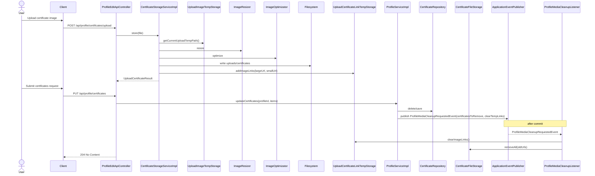

# Architecture

## Контекст
- Монолітний застосунок на Spring Boot (REST-only API; без SSR/Thymeleaf).
- Клієнти (SPA/мобільні/інтеграції) працюють через JSON/HTTP; UI живе окремо.
- Основна БД: PostgreSQL (JPA/Hibernate).
- Пошук: Elasticsearch (опційно, керується `app.search.elasticsearch.enabled`).
- Зберігання медіа: локальна файлова система (`uploads/...`).
- Асинхронність: внутрішні Spring events після коміту транзакції.

## Крок 3 (безпека)
- Поточна модель: stateful session + CSRF (Spring Security за замовчуванням) для REST API з cookie-auth, `SecurityConfig` у `auth/src/main/java/net/devstudy/resume/auth/internal/config/SecurityConfig.java`.
- Якщо SPA працює на тому ж домені (same-site), залишаємо session+CSRF і поточний `SecurityConfig` без CORS.
- Якщо SPA окремо (інший домен), це окремий етап: JWT/OIDC для автентифікації, CORS політика для API, перегляд CSRF/сесійної моделі.

## Потоки

### Редагування профілю
- Вхід: `PUT /api/profile/...` (напр. `/api/profile/info`, `/api/profile/skills`, `/api/profile/practics`) через `src/main/java/net/devstudy/resume/web/controller/api/ProfileEditApiController.java`.
- Доступ: звірка `uid` з поточним користувачем у `src/main/java/net/devstudy/resume/auth/security/CurrentProfileProvider.java`.
- Валідація: форми в `src/main/java/net/devstudy/resume/profile/form/*` + ручна валідація для `Practic`/`Education`.
- Запис: `src/main/java/net/devstudy/resume/profile/internal/service/impl/ProfileServiceImpl.java` оновлює сутності, прапорець `completed`, публікує подію індексації зі snapshot‑payload.

#### Sequence diagram

### Пошук
- Вхід: `GET /api/search` у `src/main/java/net/devstudy/resume/web/controller/SearchApiController.java`, `GET /api/suggest` у `src/main/java/net/devstudy/resume/web/controller/SuggestController.java`.
- Запит: `ProfileService.search()` делегує у `ProfileSearchService`.
- Elasticsearch: `src/main/java/net/devstudy/resume/search/service/impl/ProfileSearchServiceImpl.java` виконує ES‑запит і потім вантажить `Profile` по id з JPA.
- Fallback: при помилках ES повертається JPA‑пошук у `ProfileRepository`.
- Індексація: подія `ProfileIndexingRequestedEvent(snapshot)` → `ProfileSearchIndexingListener` → `ProfileSearchService.indexProfiles()`.

#### Sequence diagram

### Відновлення доступу
- Вхід: `POST /api/auth/restore` та `GET/POST /api/auth/restore/{token}` у `src/main/java/net/devstudy/resume/web/controller/api/AuthApiController.java`.
- Запит: `RestoreAccessServiceImpl` знаходить профіль по uid/email/phone, створює токен, хешує і зберігає у `ProfileRestore`.
- Повідомлення: `RestoreAccessMailRequestedEvent` → `RestoreAccessMailListener` → `RestoreAccessMailServiceImpl`.
- Скидання пароля: `resetPassword()` оновлює пароль через `ProfileService`, видаляє токен.

#### Sequence diagram: request restore link

#### Sequence diagram: reset password

### Медіа (фото/сертифікати)
- Вхід: `POST /api/profile/photo` і `POST /api/profile/certificates/upload` у `src/main/java/net/devstudy/resume/web/controller/api/ProfileEditApiController.java`.
- Обробка: валідація, конвертація, ресайз, оптимізація у `PhotoStorageServiceImpl` та `CertificateStorageServiceImpl`.
- Збереження: файли у `uploads/...`, повернення URL для збереження в профілі.
- Очищення: `ProfileServiceImpl` публікує `ProfileMediaCleanupRequestedEvent`, після коміту `ProfileMediaCleanupListener` виконує cleanup через `MediaCleanupService`.

#### Sequence diagram: photo upload

#### Sequence diagram: certificate upload + save

## Власники даних (Source of Truth)

### Profile domain
- `Profile`, `Contacts`, `Skill`, `Practic`, `Education`, `Course`, `Language`, `Certificate` у `src/main/java/net/devstudy/resume/profile/entity/*`.
- Власник логіки оновлення: `src/main/java/net/devstudy/resume/profile/service/impl/ProfileServiceImpl.java`.

### StaticData domain
- `SkillCategory`, `Hobby` у `src/main/java/net/devstudy/resume/staticdata/entity/SkillCategory.java` та `src/main/java/net/devstudy/resume/staticdata/entity/Hobby.java`.
- Читання: `src/main/java/net/devstudy/resume/staticdata/service/impl/StaticDataServiceImpl.java`.

### Auth domain
- `ProfileRestore` у `src/main/java/net/devstudy/resume/auth/entity/ProfileRestore.java`.
- Логіка: `src/main/java/net/devstudy/resume/auth/service/impl/RestoreAccessServiceImpl.java`.

### Search domain (похідні дані)
- `ProfileSearchDocument` у `src/main/java/net/devstudy/resume/search/ProfileSearchDocument.java`.
- Дані індексуються з профілю, не є джерелом істини.
- Індексація використовує snapshot‑payload з подій профілю, без прямого читання з БД у `search`.

### Media domain
- Файли у файловій системі (`uploads/photos`, `uploads/certificates`).
- URL‑посилання зберігаються у `Profile`/`Certificate`.

## Інтеграції та інфраструктура
- PostgreSQL для основних даних.
- Elasticsearch для пошуку (опційно).
- SMTP для відновлення доступу.

## Модульні межі й залежності

### Пропоновані модулі
- `profile`: профільні сутності, оновлення, completed‑логіка.
- `staticdata`: довідники (хобі, категорії навичок, мапи років/місяців).
- `auth`: автентифікація, відновлення доступу, обмеження доступу.
- `search`: індексація та пошук (ES), похідні документи.
- `media`: обробка/зберігання фото й сертифікатів.
- `notification`: email‑відновлення.
- `shared`: спільні типи, валідації, утиліти.
- `web`: REST‑контролери, API‑конфіги, обробка помилок, фільтри.

### Дозволені залежності (на рівні модулів)
- `web` → `profile`, `staticdata`, `auth`, `media`, `notification`, `shared`
- `profile` → `staticdata`, `shared`
- `auth` → `profile`, `notification`, `shared`
- `search` → `profile`, `shared`
- `media` → `shared`
- `notification` → `shared`
- `staticdata` → `shared`
- `shared` → (немає)

### Принципи
- Зовнішні модулі не звертаються напряму до репозиторіїв іншого модуля.
- Доступ між модулями лише через інтерфейси сервісів або події.
- Публічний контракт модуля лежить у `net.devstudy.resume.<module>.api`, реалізація — у `net.devstudy.resume.<module>.internal`.
- `search` і `media` споживають події зі snapshot/cleanup‑payload, `notification` — DTO‑події.

## Package mapping (target)

### app
| Пакет | Класи |
| --- | --- |
| `net.devstudy.resume.app` | `ResumeApplication` |
| `net.devstudy.resume.app.config` | `AppInfoConfig`, `RepositoryConfig` |

### web
| Пакет | Класи |
| --- | --- |
| `net.devstudy.resume.web.controller` | `ProfileApiController`, `SearchApiController`, `StaticDataApiController`, `SuggestController`, `SessionApiController` |
| `net.devstudy.resume.web.controller.api` | `AuthApiController`, `AccountApiController`, `ProfileEditApiController`, `CsrfApiController`, `ApiExceptionHandler` |
| `net.devstudy.resume.web.config` | `UploadResourceConfig` |
| `net.devstudy.resume.web.filter` | `AbstractFilter` |

### profile
| Пакет | Класи |
| --- | --- |
| `net.devstudy.resume.profile.api.model` | `AbstractEntity`, `AbstractFinishDateEntity`, `Profile`, `Contacts`, `Skill`, `Practic`, `Education`, `Course`, `Language`, `Certificate`, `ProfileEntity`, `ProfileCollectionField` |
| `net.devstudy.resume.profile.api.service` | `ProfileService`, `ProfileReadService`, `EditProfileService`, `ProfileSearchService` |
| `net.devstudy.resume.profile.api.dto` | `ProfileMainForm`, `InfoForm`, `ContactsForm`, `SkillForm`, `PracticForm`, `EducationForm`, `CourseForm`, `LanguageForm`, `CertificateForm`, `HobbyForm` |
| `net.devstudy.resume.profile.api.annotation` | `ProfileInfoField`, `ProfileDataFieldGroup` |
| `net.devstudy.resume.profile.api.exception` | `UidAlreadyExistsException` |
| `net.devstudy.resume.profile.api.event` | `ProfilePasswordChangedEvent`, `ProfileIndexingRequestedEvent`, `ProfileIndexingSnapshot`, `ProfileSearchRemovalRequestedEvent` |
| `net.devstudy.resume.profile.api.config` | `ProfileJpaConfig` |
| `net.devstudy.resume.profile.internal.repository.storage` | `ProfileRepository`, `SkillRepository`, `PracticRepository`, `EducationRepository`, `CourseRepository`, `LanguageRepository`, `CertificateRepository` |
| `net.devstudy.resume.profile.internal.service.impl` | `ProfileServiceImpl`, `ProfileReadServiceImpl` |

### staticdata
| Пакет | Класи |
| --- | --- |
| `net.devstudy.resume.staticdata.api.model` | `SkillCategory`, `Hobby` |
| `net.devstudy.resume.staticdata.api.service` | `StaticDataService` |
| `net.devstudy.resume.staticdata.api.config` | `StaticDataJpaConfig` |
| `net.devstudy.resume.staticdata.internal.repository.storage` | `SkillCategoryRepository`, `HobbyRepository` |
| `net.devstudy.resume.staticdata.internal.service.impl` | `StaticDataServiceImpl` |

### auth
| Пакет | Класи |
| --- | --- |
| `net.devstudy.resume.auth.api.config` | `AuthJpaConfig` |
| `net.devstudy.resume.auth.internal.config` | `SecurityConfig` |
| `net.devstudy.resume.auth.api.security` | `CurrentProfileProvider` |
| `net.devstudy.resume.auth.internal.security` | `SecurityContextCurrentProfileProvider` |
| `net.devstudy.resume.auth.internal.component.impl` | `AccessDeniedHandlerImpl` |
| `net.devstudy.resume.auth.api.service` | `RestoreAccessService`, `UidSuggestionService` |
| `net.devstudy.resume.auth.internal.service.impl` | `RestoreAccessServiceImpl`, `UidSuggestionServiceImpl`, `RememberMeService`, `CurrentProfileDetailsService` |
| `net.devstudy.resume.auth.api.model` | `CurrentProfile` |
| `net.devstudy.resume.auth.internal.model` | `CurrentProfileImpl` |
| `net.devstudy.resume.auth.api.dto` | `RegistrationForm`, `ChangeLoginForm`, `ChangePasswordForm`, `RestoreAccessForm`, `RestorePasswordForm`, `PasswordForm`, `SignUpForm` |
| `net.devstudy.resume.auth.internal.entity` | `ProfileRestore`, `RememberMeToken` |
| `net.devstudy.resume.auth.internal.repository.storage` | `ProfileRestoreRepository`, `RememberMeTokenRepository` |
| `net.devstudy.resume.auth.internal.event` | `ProfilePasswordChangedListener` |
| `net.devstudy.resume.auth.internal.util` | `SecurityUtil` |

### search
| Пакет | Класи |
| --- | --- |
| `net.devstudy.resume.search.internal.document` | `ProfileSearchDocument` |
| `net.devstudy.resume.search.internal.repository.search` | `ProfileSearchRepository` |
| `net.devstudy.resume.search.internal.mapper` | `ProfileSearchMapper` |
| `net.devstudy.resume.search.internal.service.impl` | `ProfileSearchServiceImpl`, `ProfileSearchServiceNoOp`, `ProfileSearchMapperImpl` |
| `net.devstudy.resume.search.internal.listener` | `ProfileSearchIndexingListener` |
| `net.devstudy.resume.search.internal.config` | `ElasticsearchIndexConfig`, `ElasticsearchRepositoryConfig` |

### media
| Пакет | Класи |
| --- | --- |
| `net.devstudy.resume.media.api.dto` | `UploadCertificateResult` |
| `net.devstudy.resume.media.api.service` | `PhotoStorageService`, `CertificateStorageService`, `MediaCleanupService` |
| `net.devstudy.resume.media.internal.model` | `UploadTempPath` |
| `net.devstudy.resume.media.internal.annotation` | `EnableUploadImageTempStorage` |
| `net.devstudy.resume.media.internal.component` | `ImageResizer`, `ImageOptimizator`, `ImageFormatConverter`, `UploadTempPathFactory`, `PhotoFileStorage`, `CertificateFileStorage` |
| `net.devstudy.resume.media.internal.component.impl` | `ThumbnailsImageResizer`, `JpegTranImageOptimizator`, `PngToJpegImageFormatConverter`, `DefaultUploadTempPathFactory`, `UploadImageTempStorage`, `UploadCertificateLinkTempStorage` |
| `net.devstudy.resume.media.internal.service.impl` | `PhotoStorageServiceImpl`, `CertificateStorageServiceImpl`, `MediaCleanupServiceImpl` |
| `net.devstudy.resume.media.internal.event` | `ProfileMediaCleanupListener` |
| `net.devstudy.resume.media.internal.config` | `PhotoUploadProperties`, `CertificateUploadProperties` |

### notification
| Пакет | Класи |
| --- | --- |
| `net.devstudy.resume.notification.api.event` | `RestoreAccessMailRequestedEvent` |
| `net.devstudy.resume.notification.internal.mail` | `RestoreAccessMailListener` |
| `net.devstudy.resume.notification.internal.service` | `RestoreAccessMailService` |
| `net.devstudy.resume.notification.internal.service.impl` | `RestoreAccessMailServiceImpl`, `RestoreAccessMailServiceNoOp` |
| `net.devstudy.resume.notification.internal.component` | `TemplateResolver` |
| `net.devstudy.resume.notification.internal.component.impl` | `FreemarkerTemplateResolver` |
| `net.devstudy.resume.notification.internal.config` | `RestoreMailTemplateProperties` |

### shared
| Пакет | Класи |
| --- | --- |
| `net.devstudy.resume.shared.constants` | `Constants` |
| `net.devstudy.resume.shared.event` | `ProfileMediaCleanupRequestedEvent` |
| `net.devstudy.resume.shared.model` | `AbstractModel`, `AbstractEntity`, `LanguageType`, `LanguageLevel` |
| `net.devstudy.resume.shared.util` | `BeanCopyUtil`, `DataUtil`, `SanitizationUtils` |
| `net.devstudy.resume.shared.component` | `DataBuilder`, `TranslitConverter`, `FormErrorConverter` |
| `net.devstudy.resume.shared.component.impl` | `DataBuilderImpl`, `SimpleTranslitConverter`, `JunidecodeTranslitConverter` |
| `net.devstudy.resume.shared.annotation` | `EnableFormErrorConversion` |
| `net.devstudy.resume.shared.validation.annotation` | `Adulthood`, `EnglishLanguage`, `FieldMatch`, `FirstFieldLessThanSecond`, `MinDigitCount`, `MinLowerCharCount`, `MinSpecCharCount`, `MinUpperCharCount`, `PasswordStrength`, `PasswordsMatch`, `Phone`, `RestoreIdentifier` |
| `net.devstudy.resume.shared.validation.validator` | `AdulthoodConstraintValidator`, `EnglishLanguageConstraintValidator`, `FieldMatchConstraintValidator`, `FirstFieldLessThanSecondConstraintValidator`, `MinDigitCountConstraintValidator`, `MinLowerCharCountConstraintValidator`, `MinSpecCharCountConstraintValidator`, `MinUpperCharCountConstraintValidator`, `PasswordsMatchValidator`, `PhoneConstraintValidator`, `RestoreIdentifierConstraintValidator`, `HtmlSanitized`, `HtmlSanitizedValidator` |
