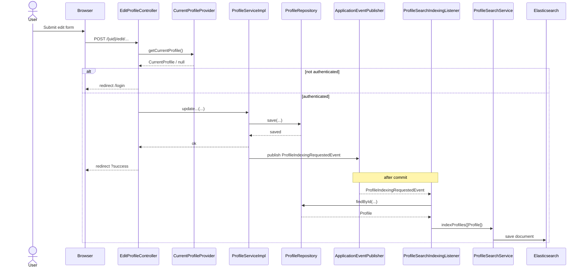
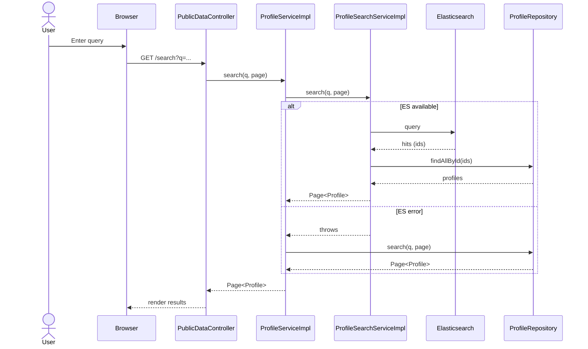
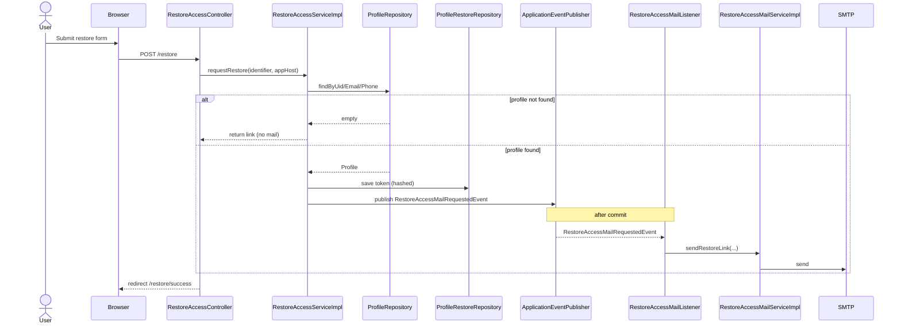
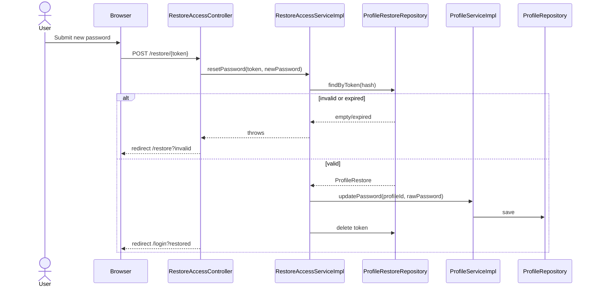
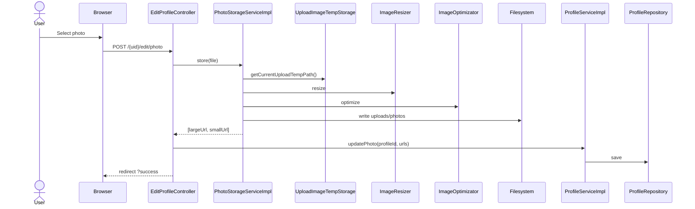
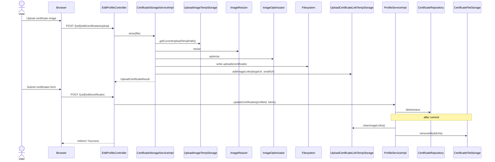

# Architecture

## Контекст
- Монолітний застосунок на Spring Boot (MVC + Thymeleaf).
- Основна БД: PostgreSQL (JPA/Hibernate).
- Пошук: Elasticsearch (опційно, керується `app.search.elasticsearch.enabled`).
- Зберігання медіа: локальна файлова система (`uploads/...`).
- Асинхронність: внутрішні Spring events після коміту транзакції.

## Потоки

### Редагування профілю
- Вхід: `GET/POST /{uid}/edit/...` через `src/main/java/net/devstudy/resume/controller/EditProfileController.java`.
- Доступ: звірка `uid` з поточним користувачем у `src/main/java/net/devstudy/resume/security/CurrentProfileProvider.java`.
- Валідація: форми в `src/main/java/net/devstudy/resume/form/*` + ручна валідація для `Practic`/`Education`.
- Запис: `src/main/java/net/devstudy/resume/service/impl/ProfileServiceImpl.java` оновлює сутності, прапорець `completed`, публікує подію індексації.

#### Sequence diagram

### Пошук
- Вхід: `GET /welcome`, `GET /search` у `src/main/java/net/devstudy/resume/controller/PublicDataController.java`, `GET /api/suggest` у `src/main/java/net/devstudy/resume/controller/SuggestController.java`.
- Запит: `ProfileService.search()` делегує у `ProfileSearchService`.
- Elasticsearch: `src/main/java/net/devstudy/resume/service/impl/ProfileSearchServiceImpl.java` виконує ES‑запит і потім вантажить `Profile` по id з JPA.
- Fallback: при помилках ES повертається JPA‑пошук у `ProfileRepository`.
- Індексація: подія `ProfileIndexingRequestedEvent` → `ProfileSearchIndexingListener` → `ProfileSearchService.indexProfiles()`.

#### Sequence diagram

### Відновлення доступу
- Вхід: `GET/POST /restore` та `GET/POST /restore/{token}` у `src/main/java/net/devstudy/resume/controller/RestoreAccessController.java`.
- Запит: `RestoreAccessServiceImpl` знаходить профіль по uid/email/phone, створює токен, хешує і зберігає у `ProfileRestore`.
- Повідомлення: `RestoreAccessMailRequestedEvent` → `RestoreAccessMailListener` → `RestoreAccessMailServiceImpl`.
- Скидання пароля: `resetPassword()` оновлює пароль через `ProfileService`, видаляє токен.

#### Sequence diagram: request restore link

#### Sequence diagram: reset password

### Медіа (фото/сертифікати)
- Вхід: `POST /{uid}/edit/photo` і `POST /{uid}/edit/certificates/upload` у `EditProfileController`.
- Обробка: валідація, конвертація, ресайз, оптимізація у `PhotoStorageServiceImpl` та `CertificateStorageServiceImpl`.
- Збереження: файли у `uploads/...`, повернення URL для збереження в профілі.
- Очищення: `PhotoFileStorage` та `CertificateFileStorage` видаляють старі файли після коміту.

#### Sequence diagram: photo upload

#### Sequence diagram: certificate upload + save

## Власники даних (Source of Truth)

### Profile domain
- `Profile`, `Contacts`, `Skill`, `Practic`, `Education`, `Course`, `Language`, `Certificate` у `src/main/java/net/devstudy/resume/entity/*`.
- Власник логіки оновлення: `src/main/java/net/devstudy/resume/service/impl/ProfileServiceImpl.java`.

### StaticData domain
- `SkillCategory`, `Hobby` у `src/main/java/net/devstudy/resume/entity/SkillCategory.java` та `src/main/java/net/devstudy/resume/entity/Hobby.java`.
- Читання: `src/main/java/net/devstudy/resume/service/impl/StaticDataServiceImpl.java`.

### Auth domain
- `ProfileRestore` у `src/main/java/net/devstudy/resume/entity/ProfileRestore.java`.
- Логіка: `src/main/java/net/devstudy/resume/service/impl/RestoreAccessServiceImpl.java`.

### Search domain (похідні дані)
- `ProfileSearchDocument` у `src/main/java/net/devstudy/resume/search/ProfileSearchDocument.java`.
- Дані індексуються з профілю, не є джерелом істини.

### Media domain
- Файли у файловій системі (`uploads/photos`, `uploads/certificates`).
- URL‑посилання зберігаються у `Profile`/`Certificate`.

## Інтеграції та інфраструктура
- PostgreSQL для основних даних.
- Elasticsearch для пошуку (опційно).
- SMTP для відновлення доступу.

## Модульні межі й залежності

### Пропоновані модулі
- `profile`: профільні сутності, оновлення, completed‑логіка.
- `staticdata`: довідники (хобі, категорії навичок, мапи років/місяців).
- `auth`: автентифікація, відновлення доступу, обмеження доступу.
- `search`: індексація та пошук (ES), похідні документи.
- `media`: обробка/зберігання фото й сертифікатів.
- `notification`: email‑відновлення.
- `shared`: спільні типи, валідації, утиліти.
- `web`: MVC‑контролери, UI‑конфіги, шаблони.

### Дозволені залежності (на рівні модулів)
- `web` → `profile`, `staticdata`, `auth`, `search`, `media`, `notification`, `shared`
- `profile` → `staticdata`, `search`, `media`, `shared`
- `auth` → `profile`, `notification`, `shared`
- `search` → `profile`, `shared`
- `media` → `shared`
- `notification` → `shared`
- `staticdata` → `shared`
- `shared` → (немає)

### Принципи
- Зовнішні модулі не звертаються напряму до репозиторіїв іншого модуля.
- Доступ між модулями лише через інтерфейси сервісів або події.
- `search` і `notification` оперують лише даними, переданими у подіях/DTO.

## Package mapping (target)

### app
| Пакет | Класи |
| --- | --- |
| `net.devstudy.resume.app` | `ResumeApplication` |
| `net.devstudy.resume.app.config` | `AppInfoConfig`, `RepositoryConfig` |

### web
| Пакет | Класи |
| --- | --- |
| `net.devstudy.resume.web.controller.auth` | `AuthController`, `AccountController`, `RestoreAccessController` |
| `net.devstudy.resume.web.controller.profile` | `EditProfileController`, `EditShortcutController` |
| `net.devstudy.resume.web.controller.public` | `PublicDataController` |
| `net.devstudy.resume.web.controller.search` | `SuggestController` |
| `net.devstudy.resume.web.advice` | `GlobalExceptionHandler` |
| `net.devstudy.resume.web.config` | `UiProperties`, `UiModelAttributes`, `UploadResourceConfig` |
| `net.devstudy.resume.web.filter` | `AbstractFilter` |

### profile
| Пакет | Класи |
| --- | --- |
| `net.devstudy.resume.profile.entity` | `AbstractEntity`, `AbstractFinishDateEntity`, `Profile`, `Contacts`, `Skill`, `Practic`, `Education`, `Course`, `Language`, `Certificate`, `ProfileEntity`, `ProfileCollectionField` |
| `net.devstudy.resume.profile.repository` | `ProfileRepository`, `SkillRepository`, `PracticRepository`, `EducationRepository`, `CourseRepository`, `LanguageRepository`, `CertificateRepository` |
| `net.devstudy.resume.profile.service` | `ProfileService`, `ProfileServiceImpl` |
| `net.devstudy.resume.profile.form` | `ProfileMainForm`, `InfoForm`, `ContactsForm`, `SkillForm`, `PracticForm`, `EducationForm`, `CourseForm`, `LanguageForm`, `CertificateForm`, `HobbyForm` |
| `net.devstudy.resume.profile.model` | `LanguageType`, `LanguageLevel` |
| `net.devstudy.resume.profile.annotation` | `ProfileInfoField`, `ProfileDataFieldGroup` |
| `net.devstudy.resume.profile.exception` | `UidAlreadyExistsException` |

### staticdata
| Пакет | Класи |
| --- | --- |
| `net.devstudy.resume.staticdata.entity` | `SkillCategory`, `Hobby` |
| `net.devstudy.resume.staticdata.repository` | `SkillCategoryRepository`, `HobbyRepository` |
| `net.devstudy.resume.staticdata.service` | `StaticDataService`, `StaticDataServiceImpl` |

### auth
| Пакет | Класи |
| --- | --- |
| `net.devstudy.resume.auth.config` | `SecurityConfig` |
| `net.devstudy.resume.auth.security` | `CurrentProfileProvider`, `SecurityContextCurrentProfileProvider`, `AccessDeniedHandlerImpl`, `CurrentProfileDetailsService` |
| `net.devstudy.resume.auth.entity` | `ProfileRestore`, `RememberMeToken` |
| `net.devstudy.resume.auth.repository` | `ProfileRestoreRepository`, `RememberMeTokenRepository` |
| `net.devstudy.resume.auth.service` | `RestoreAccessService`, `RestoreAccessServiceImpl`, `UidSuggestionService`, `UidSuggestionServiceImpl`, `RememberMeService` |
| `net.devstudy.resume.auth.model` | `CurrentProfile`, `CurrentProfileImpl` |
| `net.devstudy.resume.auth.form` | `RegistrationForm`, `ChangeLoginForm`, `ChangePasswordForm`, `RestoreAccessForm`, `RestorePasswordForm`, `PasswordForm`, `SignUpForm` |
| `net.devstudy.resume.auth.util` | `SecurityUtil` |

### search
| Пакет | Класи |
| --- | --- |
| `net.devstudy.resume.search.document` | `ProfileSearchDocument` |
| `net.devstudy.resume.search.repository` | `ProfileSearchRepository` |
| `net.devstudy.resume.search.service` | `ProfileSearchService`, `ProfileSearchServiceImpl`, `ProfileSearchServiceNoOp` |
| `net.devstudy.resume.search.mapper` | `ProfileSearchMapper`, `ProfileSearchMapperImpl` |
| `net.devstudy.resume.search.listener` | `ProfileSearchIndexingListener` |
| `net.devstudy.resume.search.event` | `ProfileIndexingRequestedEvent` |
| `net.devstudy.resume.search.config` | `ElasticsearchIndexConfig`, `ElasticsearchRepositoryConfig` |

### media
| Пакет | Класи |
| --- | --- |
| `net.devstudy.resume.media.model` | `UploadTempPath`, `UploadCertificateResult` |
| `net.devstudy.resume.media.annotation` | `EnableUploadImageTempStorage` |
| `net.devstudy.resume.media.component` | `ImageResizer`, `ImageOptimizator`, `ImageFormatConverter`, `UploadTempPathFactory`, `PhotoFileStorage`, `CertificateFileStorage` |
| `net.devstudy.resume.media.component.impl` | `ThumbnailsImageResizer`, `JpegTranImageOptimizator`, `PngToJpegImageFormatConverter`, `DefaultUploadTempPathFactory`, `UploadImageTempStorage`, `UploadCertificateLinkTempStorage` |
| `net.devstudy.resume.media.service` | `PhotoStorageService`, `PhotoStorageServiceImpl`, `CertificateStorageService`, `CertificateStorageServiceImpl` |
| `net.devstudy.resume.media.config` | `PhotoUploadProperties`, `CertificateUploadProperties` |

### notification
| Пакет | Класи |
| --- | --- |
| `net.devstudy.resume.notification.event` | `RestoreAccessMailRequestedEvent` |
| `net.devstudy.resume.notification.listener` | `RestoreAccessMailListener` |
| `net.devstudy.resume.notification.service` | `RestoreAccessMailService`, `RestoreAccessMailServiceImpl`, `RestoreAccessMailServiceNoOp` |
| `net.devstudy.resume.notification.template` | `TemplateResolver`, `FreemarkerTemplateResolver` |
| `net.devstudy.resume.notification.config` | `RestoreMailTemplateProperties` |

### shared
| Пакет | Класи |
| --- | --- |
| `net.devstudy.resume.shared.constants` | `Constants` |
| `net.devstudy.resume.shared.model` | `AbstractModel` |
| `net.devstudy.resume.shared.util` | `BeanCopyUtil`, `DataUtil`, `SanitizationUtils` |
| `net.devstudy.resume.shared.component` | `DataBuilder`, `TranslitConverter`, `FormErrorConverter` |
| `net.devstudy.resume.shared.component.impl` | `DataBuilderImpl`, `SimpleTranslitConverter`, `JunidecodeTranslitConverter` |
| `net.devstudy.resume.shared.annotation` | `EnableFormErrorConversion` |
| `net.devstudy.resume.shared.validation.annotation` | `Adulthood`, `EnglishLanguage`, `FieldMatch`, `FirstFieldLessThanSecond`, `MinDigitCount`, `MinLowerCharCount`, `MinSpecCharCount`, `MinUpperCharCount`, `PasswordStrength`, `PasswordsMatch`, `Phone`, `RestoreIdentifier` |
| `net.devstudy.resume.shared.validation.validator` | `AdulthoodConstraintValidator`, `EnglishLanguageConstraintValidator`, `FieldMatchConstraintValidator`, `FirstFieldLessThanSecondConstraintValidator`, `MinDigitCountConstraintValidator`, `MinLowerCharCountConstraintValidator`, `MinSpecCharCountConstraintValidator`, `MinUpperCharCountConstraintValidator`, `PasswordsMatchValidator`, `PhoneConstraintValidator`, `RestoreIdentifierConstraintValidator`, `HtmlSanitized`, `HtmlSanitizedValidator` |
